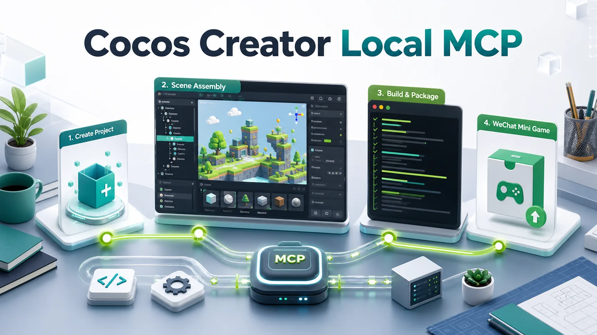

# Cocos Creator Local MCP

[English](./README.md) | 简体中文



[](https://nodejs.org/)
[](https://www.typescriptlang.org/)
[](https://modelcontextprotocol.io/)
[](https://www.cocos.com/creator)
[](./LICENSE)

`cocos-creator-local-mcp` 是一个面向本地 Cocos Creator 自动化的 MCP Server。它为 Codex、Claude、Cursor 等支持 MCP 的编码 Agent 提供一组稳定工具，用于创建 Cocos Creator 3.8 项目、安装项目级编辑器桥接、装配场景、保存编辑器状态，并在本地构建微信小游戏包。

这个项目只负责 **Cocos 本地项目自动化**，不负责 AI 素材生成。如果你的工作流需要生成角色、UI、音效、音乐或 tileset，请把它和独立的素材生成 MCP 搭配使用。

## 为什么需要它

编码 Agent 可以写 TypeScript，但 Cocos 游戏不是只写脚本就完成了。一个可运行的本地原型还需要场景文件、节点层级、序列化组件引用、编辑器导入、构建配置和平台输出检查。

这个 MCP 打通的是这条本地链路：

```text
创建项目 -> 创建场景 -> 生成脚本 -> 打开编辑器
  -> 应用场景蓝图 -> 保存场景 -> 写入构建配置
  -> 构建 wechatgame -> 检查输出
```

它适合安装了 Cocos Creator 的开发机，用于 Agent 驱动的 Cocos 微信小游戏开发。

## 亮点

- 本地优先，不依赖云服务。
- 从 Cocos Creator 内置模板创建 3.8 项目。
- 安装项目级 Editor Bridge，用于场景检查和修改。
- 生成小游戏起步脚本和场景装配蓝图。
- 通过桥接打开场景、创建节点、挂组件、设置属性并保存。
- 提供高层 Sprite 放置工具，把生成素材直接挂进场景。
- 生成可复用的 `wechatgame` 构建配置。
- 调用 Cocos Creator 命令行执行本地构建。
- 检查微信小游戏输出目录、必备文件和包体大小预警。
- 通过微信开发者工具官方 CLI 打开本地构建、生成 preview 信息、清缓存和关闭项目。
- 静态审计包体、纹理、音频、脚本和首包风险。
- 汇总垂直切片运行证据，明确区分“构建通过”“DevTools 已打开”和“运行时已验证”。
- 边界清楚：本 MCP 负责本地 Cocos 自动化，素材生成交给独立素材 MCP。

## 快速链接

- [安装](#安装)
- [MCP 客户端配置](#mcp-客户端配置)
- [工具列表](#工具列表)
- [配套 Codex Skills](#配套-codex-skills)
- [从 0 到本地微信小游戏构建](#从-0-到本地微信小游戏构建)
- [给 LLM 的安装 Prompt](./docs/installation.md#llm-install-prompt)
- [架构说明](./docs/ARCHITECTURE.md)
- [卸载](./docs/installation.md#uninstall)

## 环境要求

- Node.js 20 或更新版本。
- 当前默认路径说明以 macOS 为主。
- 本机安装 Cocos Creator 3.8.8，或者在工具调用里传入 `creatorPath`。
- 微信开发者工具是可选项；只有需要在模拟器里打开/调试构建产物时才需要。

macOS 默认 Cocos Creator 可执行文件路径：

```text
/Applications/Cocos/Creator/3.8.8/CocosCreator.app/Contents/MacOS/CocosCreator
```

macOS 默认微信开发者工具 CLI 路径：

```text
/Applications/wechatwebdevtools.app/Contents/MacOS/cli
```

## 安装

```bash
git clone https://github.com/lightblink/cocos-creator-local-mcp.git
cd cocos-creator-local-mcp
npm install
npm run build
```

开发模式运行：

```bash
npm run dev
```

运行构建后的 Server：

```bash
node dist/index.js
```

验证项目：

```bash
npm run check
```

## MCP 客户端配置

适用于通过 stdio 启动 MCP Server 的客户端：

```json
{
  "mcpServers": {
    "cocos-creator-local": {
      "command": "node",
      "args": [
        "/absolute/path/to/cocos-creator-local-mcp/dist/index.js"
      ],
      "startup_timeout_sec": 120
    }
  }
}
```

如果同时使用素材生成 MCP，请保持两个 Server 独立：

```json
{
  "mcpServers": {
    "cocos-creator-local": {
      "command": "node",
      "args": [
        "/absolute/path/to/cocos-creator-local-mcp/dist/index.js"
      ]
    },
    "cocos-asset-forge": {
      "command": "node",
      "args": [
        "/absolute/path/to/cocos-asset-forge-mcp/dist/index.js",
        "--config",
        "/absolute/path/to/cocos-asset-forge-mcp/examples/config.example.json"
      ]
    }
  }
}
```

## 工具列表

| 工具 | 用途 |
| --- | --- |
| `cocos_local_get_environment` | 检测本地 Cocos Creator 和微信开发者工具 CLI 路径。 |
| `cocos_local_create_project` | 从本地 Cocos Creator 内置模板创建 3.8 项目。 |
| `cocos_local_open_project` | 启动 Cocos Creator 打开项目，并可等待 bridge 就绪。 |
| `cocos_local_create_scene_from_template` | 从本地 Creator 模板创建场景。 |
| `cocos_local_inspect_project` | 检查项目目录、settings、场景、脚本、bridge 和构建输出。 |
| `cocos_local_create_component_script` | 创建 Cocos Creator TypeScript 组件脚本。 |
| `cocos_local_create_minigame_skeleton` | 生成小游戏基础脚本和场景蓝图。 |
| `cocos_local_create_architecture_skeleton` | 为塔防等游戏生成可选的多系统 TypeScript 架构起点。 |
| `cocos_local_install_editor_bridge` | 安装项目级编辑器桥接扩展。 |
| `cocos_local_check_editor_bridge` | 检查桥接文件并可 ping HTTP bridge。 |
| `cocos_local_wait_for_editor_bridge` | 等待 bridge 响应。 |
| `cocos_local_call_editor_bridge` | 直接调用 bridge HTTP 路由。 |
| `cocos_local_open_scene` | 在运行中的 Cocos 编辑器里打开场景。 |
| `cocos_local_apply_scene_blueprint` | 通过 bridge 应用场景蓝图并可保存。 |
| `cocos_local_assign_sprite_frame` | 把解析到的 SpriteFrame 资源赋给已有节点的 `Sprite.spriteFrame`。 |
| `cocos_local_assign_sprite_frame_sequence` | 把有序生成帧素材赋给组件数组属性，例如 `SpriteFrameAnimator.frames`。 |
| `cocos_local_create_sprite_node` | 确保一个 Sprite 节点存在，并赋予生成的 SpriteFrame 素材。 |
| `cocos_local_place_sprite_assets` | 一次性把多个生成 sprite 素材放进场景。 |
| `cocos_local_create_wechat_build_config` | 写入可复用的本地微信小游戏构建配置，可带 `designResolution` 作为手机适配策略。 |
| `cocos_local_build_wechatgame` | 执行本地 Cocos `wechatgame` 命令行构建。 |
| `cocos_local_check_wechat_build_output` | 检查构建输出必备文件和包体大小预警。 |
| `cocos_local_open_wechat_devtools` | 通过官方 CLI 在微信开发者工具中打开本地 `build/wechatgame`。 |
| `cocos_local_preview_wechat_devtools` | 执行微信开发者工具 preview，并可写出 QR/info 证据文件。 |
| `cocos_local_manage_wechat_devtools` | 本地清理 DevTools 缓存、关闭项目或退出 DevTools。 |
| `cocos_local_audit_runtime_package` | 审计输出/资源的包体预算、大纹理、大音频和首包风险。 |
| `cocos_local_collect_runtime_evidence` | 汇总场景、bridge、构建、DevTools、截图、日志和人工观察证据，给出验证状态。 |

## 配套 Codex Skills

仓库内置了可选的 Codex skills，位于 [`skills/`](./skills)。MCP 提供可执行的本地自动化工具；skills 负责告诉 agent 什么时候、怎样使用这些工具来完成游戏架构、场景/Prefab 装配和本地微信小游戏构建。

包含的 skills：

- [`cocos-creator-gameplay-architecture`](./skills/cocos-creator-gameplay-architecture)：实现可维护的 Cocos Creator 游戏脚本、UI 系统和运行时流程。
- [`cocos-game-reference-research-director`](./skills/cocos-game-reference-research-director)：在策划前调研参考游戏、品类预期、IP 安全设计支柱和后续 skill 交接。
- [`cocos-interaction-ux-director`](./skills/cocos-interaction-ux-director)：定义触屏优先的操作、HUD 状态、反馈、可读性和自适应布局要求。
- [`cocos-playtest-qa-director`](./skills/cocos-playtest-qa-director)：规划试玩验收门槛、收集运行时证据，并验证本地可玩性结论是否成立。
- [`cocos-scene-prefab-assembly`](./skills/cocos-scene-prefab-assembly)：把场景、Prefab、组件、序列化属性和生成素材装配成可运行的本地场景。
- [`cocos-wechat-local-build`](./skills/cocos-wechat-local-build)：准备、构建、检查和调试本地 `wechatgame` 包，不负责发布。

安装到 Codex：

```bash
mkdir -p ~/.codex/skills
cp -R skills/cocos-creator-gameplay-architecture ~/.codex/skills/
cp -R skills/cocos-game-reference-research-director ~/.codex/skills/
cp -R skills/cocos-interaction-ux-director ~/.codex/skills/
cp -R skills/cocos-playtest-qa-director ~/.codex/skills/
cp -R skills/cocos-scene-prefab-assembly ~/.codex/skills/
cp -R skills/cocos-wechat-local-build ~/.codex/skills/
```

使用这些 skills 时，请同时在 MCP 客户端中配置本 server，并暴露为 `cocos_creator_local`。如果工作流还需要生成精灵图、音频、UI 包或 tileset，请搭配独立的 Cocos Asset Forge MCP。

## 从生成素材到场景

和素材生成 MCP 搭配使用时，建议把生成的 PNG 写到 Cocos 项目的 `assets/` 目录下，等待 Cocos AssetDB 导入完成，再用 `cocos_local_place_sprite_assets` 放入场景。

示例：

```json
{
  "projectRoot": "/absolute/path/to/my-cocos-project",
  "openScene": true,
  "sprites": [
    {
      "assetPath": "assets/generated/background.png",
      "nodePath": "Scene/Canvas/GameRoot/Background",
      "position": { "x": 0, "y": 0, "z": -10 },
      "scale": { "x": 1, "y": 1, "z": 1 }
    },
    {
      "assetPath": "assets/generated/player.png",
      "nodePath": "Scene/Canvas/GameRoot/Player",
      "position": { "x": 0, "y": -120, "z": 0 },
      "scale": { "x": 1, "y": 1, "z": 1 }
    }
  ]
}
```

`assetPath` 支持 `db://assets/...`、`assets/...`、项目内绝对路径或 SpriteFrame UUID。工具会查询 AssetDB，并优先选择 SpriteFrame sub-asset 赋给 `Sprite.spriteFrame`。

如果素材 MCP 生成的是逐帧动画，请把单帧 PNG 导入 `assets/`，在运行时组件中声明类似 `@property([SpriteFrame]) frames` 的数组属性，然后调用 `cocos_local_assign_sprite_frame_sequence`：

```json
{
  "projectRoot": "/absolute/path/to/my-cocos-project",
  "nodePath": "Scene/Canvas/GameRoot/Player",
  "componentType": "SpriteFrameAnimator",
  "property": "frames",
  "assetPaths": [
    "assets/art/characters/run/frame-001.png",
    "assets/art/characters/run/frame-002.png",
    "assets/art/characters/run/frame-003.png"
  ],
  "addComponent": true
}
```

这个工具会保持传入顺序，把每个 PNG 解析成 Cocos 导入后的 SpriteFrame sub-asset，通过 editor bridge 写入数组属性，并按需保存场景。

## 从 0 到本地微信小游戏构建

1. 调用 `cocos_local_get_environment` 确认本地路径。
2. 调用 `cocos_local_create_project` 并传入目标 `projectRoot`。
3. 调用 `cocos_local_open_project`，设置 `waitForBridge: true`。
4. 对非平凡玩法，可先考虑 `cocos_local_create_architecture_skeleton`，再按实际切片裁剪或合并建议系统。
5. 调用 `cocos_local_apply_scene_blueprint` 创建并装配起步场景。
6. 调用 `cocos_local_create_wechat_build_config`，传入 `startScenePath: "assets/scenes/Main.scene"`，并为手机优先小游戏显式传入 `designResolution`，例如 `{ "width": 720, "height": 1280, "fitWidth": true, "fitHeight": false }`。
7. 调用 `cocos_local_build_wechatgame`。
8. 调用 `cocos_local_check_wechat_build_output`。
9. 调用 `cocos_local_audit_runtime_package`，在打开模拟器前检查包体和资源尺寸风险。
10. 调用 `cocos_local_open_wechat_devtools` 打开本地 `build/wechatgame`。
11. 观察启动、首次输入、核心循环、结算/失败、重开和日志后，调用 `cocos_local_collect_runtime_evidence`。

Cocos Creator 命令行构建成功时会返回 exit code `36`。

验证状态请使用明确口径：

- 构建通过：构建完成，输出文件检查通过。
- DevTools 已打开：微信开发者工具接受了本地构建目录。
- 运行时已验证：启动、首次输入、核心循环、结算/失败、重开、日志、截图或场景摘要证据均已检查。

不要只凭构建产物就声称垂直切片已经运行时验证。

## Editor Bridge

bridge 会安装到目标 Cocos 项目的项目级扩展目录：

```text
extensions/codex-editor-bridge/
```

项目在 Cocos Creator 中打开时，这个扩展会暴露本地 HTTP API。MCP 通过这些 API 检查和修改当前活动场景。该扩展只用于本地自动化，不应该作为游戏运行时代码发布。

## 本地安全边界

这个 Server 只处理本地开发和打包，不会：

- 上传微信小游戏代码
- 提交审核或发布版本
- 管理生产 appid 或密钥
- 修改支付、广告、登录或后端配置
- 生成美术或音频素材

纯本地玩法检查可以使用占位 appid。测试微信平台 API 前，请换成真实 appid。

## 开发

```bash
npm install
npm run typecheck
npm test
npm run build
```

单元测试会验证 Editor Bridge scaffold 和小游戏骨架生成。完整本地烟测需要主机安装 Cocos Creator 3.8.8。

## 商标说明

Cocos Creator 和微信是其各自所有者的商标。本项目是非官方本地自动化工具，不隶属于 Cocos 或腾讯，也未获得其背书。
